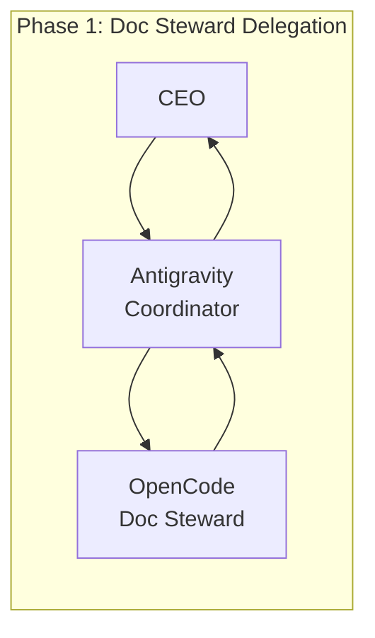
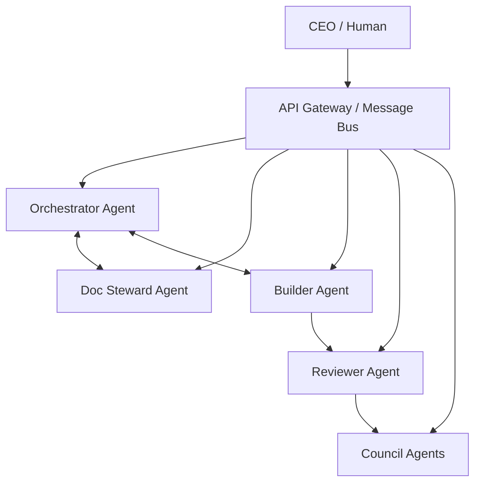

# Agent Delegation Architecture — Phase 1 Implementation Plan

| Field | Value |
|-------|-------|
| **Version** | 0.1 |
| **Date** | 2026-01-04 |
| **Author** | Antigravity |
| **Status** | DRAFT — Awaiting CEO Review |
| **Council Trigger** | CT-2 (New Protocol / Agent Constitution) |

---

## Executive Summary

Delegate documentation stewardship tasks from Antigravity to OpenCode via programmatic API calls, with Antigravity acting as orchestrator/validator. This is Phase 1 of a multi-phase architecture that will eventually enable fully autonomous multi-agent operation.

---

## Multi-Phase Vision



| Phase | Timeline | State | Antigravity Role | OpenCode Role |
|-------|----------|-------|------------------|---------------|
| **1** | Now | Shadow Mode | Orchestrator + Validator | Doc Steward (drafts only) |
| **2** | +2 weeks | Supervised | Orchestrator | Doc Steward (commits to branch) |
| **3** | +4 weeks | Delegated | Orchestrator | Doc Steward + Builder |
| **4** | +8 weeks | Autonomous | Peer Agent | Doc Steward + Builder |
| **5** | Future | Full Multi-Agent | One of many agents | One of many agents |

### End-State Vision



All agents communicate via structured **YAML packets** per `lifeos_packet_schemas_v1.yaml`. No agent has privileged access — all operate under LifeOS governance.

---

## Phase 1 Scope (This Plan)

### Objective

Enable Antigravity to delegate doc stewardship tasks to OpenCode via API, validate outputs, and apply changes — reducing token consumption while maintaining governance compliance.

### In Scope

1. Create `OPENCODE.md` — agent constitution for OpenCode as Doc Steward
2. Create `DOC_STEWARD_CONTEXT_PACK` schema — what context to send
3. Create `scripts/delegate_to_opencode.py` — delegation wrapper
4. Create mission telemetry logging
5. Test with one real stewardship task (shadow mode)

### Explicitly Out of Scope (Deferred to Phase 2+)

- OpenCode committing directly
- Builder role delegation
- Orchestrator replacement
- Multi-agent message bus
- Cost optimization tuning

---

## User Review Required

> [!IMPORTANT]
> This plan creates a new agent constitution (`OPENCODE.md`) and a new protocol (`DOC_STEWARD_CONTEXT_PACK`). Per CT-2 triggers, Council review is required before merge.

### Key Decisions Needed

1. **OpenCode model**: Should doc steward use `gemini-2.0-flash-001` (cheap) or `gemini-2.5-pro` (expensive, smarter)?
2. **Failure policy**: If OpenCode fails, should I retry once or escalate immediately?
3. **Commit policy Phase 1**: Confirm OpenCode produces drafts only, I apply changes?

---

## Proposed Changes

### Component 1: Agent Constitution

#### [NEW] [OPENCODE.md](file:///c:/Users/cabra/Projects/LifeOS/OPENCODE.md)

A slimmed-down agent constitution scoped to the **Doc Steward role only**:

- Inherits authority chain from GEMINI.md
- Scoped to:
  - Reading documentation and code
  - Updating `docs/INDEX.md` timestamps
  - Regenerating corpus files
  - Producing `REVIEW_PACKET` for completed work
- Prohibited from:
  - Modifying governance files (`00_foundations`, `01_governance`)
  - Creating implementation plans (that's the Coordinator's job)
  - Committing directly (Phase 1)
- Must emit `DOC_STEWARD_RESULT` packet on completion

---

### Component 2: Context Pack Schema

#### [NEW] [doc_steward_context_pack_v1.yaml](file:///c:/Users/cabra/Projects/LifeOS/docs/02_protocols/doc_steward_context_pack_v1.yaml)

Schema defining what context to send when delegating stewardship:

```yaml
doc_steward_context_pack:
  pack_id: string           # UUID
  created_at: datetime      # ISO 8601
  created_by: string        # Antigravity
  
  mission:
    type: string            # INDEX_UPDATE | CORPUS_REGEN | DOC_MOVE | FULL_STEWARD
    description: string     # Human-readable task
    files_to_steward: list  # Paths to files being added/modified
    
  context:
    index_snapshot: string  # Current docs/INDEX.md content
    state_snapshot: string  # Current LIFEOS_STATE.md content
    changed_files: list     # Files that triggered stewardship
      - path: string
        change_type: string # CREATED | MODIFIED | DELETED
        
  constraints:
    constitution_ref: string  # Path to OPENCODE.md
    max_files_to_modify: int  # Safety limit
    allowed_paths: list       # Whitelist
    forbidden_paths: list     # Blacklist (governance)
    
  response_format:
    packet_type: "DOC_STEWARD_RESULT"
    required_fields:
      - files_modified
      - index_updated
      - corpus_regenerated
      - review_packet_path
```

---

### Component 3: Delegation Script

#### [NEW] [delegate_to_opencode.py](file:///c:/Users/cabra/Projects/LifeOS/scripts/delegate_to_opencode.py)

Orchestration script that:

1. **Packages context** — reads relevant files, creates context pack
2. **Calls OpenCode API** — creates session, sends prompt with context
3. **Waits for response** — with timeout handling
4. **Validates output** — checks packet completeness, runs `check_readiness.py`
5. **Applies changes** — writes files if validation passes
6. **Logs telemetry** — tokens used, time elapsed, success/fail

```python
# Pseudocode structure
class DocStewardDelegator:
    def __init__(self, opencode_url, model):
        ...
    
    def create_context_pack(self, mission_type, files):
        # Read INDEX, STATE, changed files
        # Return DOC_STEWARD_CONTEXT_PACK
        
    def delegate(self, context_pack) -> DocStewardResult:
        # Call OpenCode API
        # Parse response into result packet
        
    def validate(self, result) -> ValidationResult:
        # Check files exist
        # Verify packet completeness
        # Run readiness check
        
    def apply(self, result):
        # Write files to disk
        # Return applied paths
```

---

### Component 4: Telemetry

#### [NEW] [artifacts/opencode_missions/](file:///c:/Users/cabra/Projects/LifeOS/artifacts/opencode_missions/)

Directory for mission logs:

```
artifacts/opencode_missions/
  2026-01-04_index_update_abc123.yaml    # One file per mission
```

Each log contains:
- Context pack sent
- Response received
- Validation result
- Time elapsed
- Token count (if available from API)
- Files applied

---

## Verification Plan

### Automated Tests

| Test | Command | What It Verifies |
|------|---------|------------------|
| Schema validation | `python -c "import yaml; yaml.safe_load(open('docs/02_protocols/doc_steward_context_pack_v1.yaml'))"` | YAML is valid |
| Script syntax | `python -m py_compile scripts/delegate_to_opencode.py` | Python compiles |
| Unit tests | `pytest scripts/tests/test_delegate_to_opencode.py -v` | Core logic works |

### Integration Test (Shadow Mode Trial)

**Scenario**: Delegate a simple INDEX timestamp update to OpenCode

1. Start OpenCode server: `opencode --api-only`
2. Run delegation: `python scripts/delegate_to_opencode.py --mission INDEX_UPDATE --dry-run`
3. Verify:
   - Context pack was created correctly
   - OpenCode responded with valid packet
   - No files were modified (dry-run)
   - Telemetry log was created

### Manual Verification (CEO)

1. Review `OPENCODE.md` for appropriate scope restrictions
2. Confirm delegation script has adequate error handling
3. Approve shadow mode trial before live usage

---

## Rollback Plan

If Phase 1 fails:

1. Delete `OPENCODE.md` 
2. Delete `scripts/delegate_to_opencode.py`
3. Delete `docs/02_protocols/doc_steward_context_pack_v1.yaml`
4. Revert to Antigravity-only stewardship

No governance files are modified, so rollback is clean.

---

## Success Criteria

| Criterion | Measurement |
|-----------|-------------|
| OpenCode completes 1 stewardship task | Mission log shows SUCCESS |
| Output passes validation | `check_readiness.py` returns 0 |
| Token reduction observed | Telemetry shows < 50% of Antigravity equivalent |
| No governance violations | Review Packet shows clean stewardship |

---

## Next Steps After Approval

1. ✅ CEO approves this plan
2. Create `OPENCODE.md`
3. Create context pack schema
4. Create delegation script
5. Run shadow mode trial
6. Create Review Packet with results
7. Council review for CT-2 (new protocol)
8. Merge and proceed to Phase 2 planning

---

*This plan was drafted by Antigravity under LifeOS DAP v2.0 governance.*
