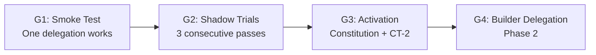

# Plan: Agent Delegation Phase 1 — Doc Steward Spike

| Field | Value |
|-------|-------|
| **Version** | 0.2 |
| **Date** | 2026-01-04 |
| **Author** | Antigravity |
| **Status** | DRAFT — Awaiting CEO Approval |

---

## Executive Summary

Spike-first validation of doc steward delegation using capability gates. Role-based naming (DOC_STEWARD), not tool-based (OpenCode). Governance deferred until proven.

---

## Vision: Capability-Gated Progression



| Gate | Evidence Required | Outcome |
|------|-------------------|---------|
| **G1** | 1 smoke test ledger entry | Orchestrator→Steward→Verifier loop works |
| **G2** | 3 consecutive shadow trials pass | Deterministic, repeatable, safe |
| **G3** | DOC_STEWARD.md ratified, CT-2 approval | Governance activated |
| **G4** | Builder spike passes G1-G3 equivalent | Multi-role delegation |

---

## Phase 1 Scope (This Mission)

### In Scope
1. `scripts/delegate_to_doc_steward.py` — thin orchestrator shim (dry-run default)
2. `runtime/verifiers/doc_verifier.py` — semantic validation (INDEX hygiene)
3. Minimal tests for determinism
4. Smoke test (G1) + 3 shadow trials (G2)
5. Spike findings note (continue/abort/pivot)

### Explicitly Out of Scope (Deferred to G3+)
- `DOC_STEWARD.md` (role constitution) — **deferred until G3**
- Formal packet schema additions to `lifeos_packet_schemas_v1.yaml` — **deferred until G3**
- Autonomous commits/branches — Phase 1 is dry-run/shadow only
- Multi-agent bus / builder delegation

---

## Canonical Alignment

### Authority Sources

| Element | Source | Status |
|---------|--------|--------|
| `DOC_STEWARD_REQUEST/RESULT` | [North-Star Operating Model v0.5](file:///c:/Users/cabra/Projects/LifeOS/docs/00_foundations/ARCH_Builder_North-Star_Operating_Model_v0.5.md#L164) | Defined |
| `DL_DOC` ledger | Same, line 108 | Defined |
| Governance Follows Capability | [Operating Model v0.3](file:///c:/Users/cabra/Projects/LifeOS/docs/00_foundations/ARCH_LifeOS_Operating_Model_v0.3.md#L41) | Authoritative |
| Tool ≠ Role | North-Star v0.5, line 40 | "OpenCode is endpoint, not role" |

### Schema Gap (Non-Blocking)

`DOC_STEWARD_REQUEST/RESULT` not in `lifeos_packet_schemas_v1.yaml`. Using inline minimal schema for Phase 1; formalize at G3.

---

## Architecture

### Role Names (Per North-Star)

| Role | Responsibility | Phase 1 Implementation |
|------|----------------|------------------------|
| Orchestrator | Route, validate, record | `delegate_to_doc_steward.py` |
| DOC_STEWARD | Execute stewardship | OpenCode via API |
| Verifier | Semantic validation | `doc_verifier.py` |

### Packet Flow

```
Orchestrator
    │
    ├─ DOC_STEWARD_REQUEST ──► DOC_STEWARD (OpenCode)
    │                              │
    │◄─ DOC_STEWARD_RESULT ────────┘
    │
    ├─ Invoke doc_verifier.py
    │
    └─ Emit to DL_DOC ledger (artifacts/ledger/dl_doc/)
```

### Ledger Topology

```
artifacts/ledger/
  dl_doc/
    2026-01-04_smoke_test_<uuid>.yaml
    2026-01-04_shadow_trial_<uuid>.yaml
    ...
```

---

## Deliverables

### 1. delegate_to_doc_steward.py

```python
# Thin orchestrator shim
class DocStewardOrchestrator:
    def create_request(self, mission_type, files) -> DocStewardRequest
    def dispatch(self, request) -> DocStewardResult
    def verify(self, result) -> VerifierOutcome
    def emit_to_ledger(self, request, result, outcome)
    def run(self, dry_run=True)  # dry_run default!
```

### 2. doc_verifier.py

```python
# Semantic validation
class DocVerifier:
    def check_index_hygiene(self) -> list[Finding]
    def check_link_integrity(self) -> list[Finding]
    def verify(self, result) -> VerifierOutcome
```

### 3. Minimal Packet Schema (Inline)

```yaml
doc_steward_request:
  packet_id: string
  packet_type: "DOC_STEWARD_REQUEST"
  case_id: string
  mission_type: string  # INDEX_UPDATE | CORPUS_REGEN | DOC_MOVE
  files_to_steward: list
  constraints:
    max_files: int
    allowed_paths: list
    dry_run: bool

doc_steward_result:
  packet_id: string
  packet_type: "DOC_STEWARD_RESULT"
  request_ref: string
  status: string  # SUCCESS | PARTIAL | FAILED
  files_modified: list
  verifier_outcome: string
  evidence_ref: string
```

---

## Verification Plan

### G1: Smoke Test

**Command**: `python scripts/delegate_to_doc_steward.py --mission INDEX_UPDATE --dry-run`

**Pass Criteria**:
- Request packet created
- OpenCode responds
- Verifier runs
- Ledger entry emitted
- No file writes (dry-run)

### G2: Shadow Trials (3 consecutive)

**Command**: Same as G1, run 3 times with different `case_id`

**Pass Criteria**:
- All 3 return SUCCESS
- Verifier passes all 3
- Ledger contains 3 sequential entries
- Deterministic outputs (hashes match for same input)

---

## Abort/Rollback Thresholds

| Condition | Action |
|-----------|--------|
| OpenCode API unreachable | BLOCKED; wait for fix |
| Smoke test fails 3x | ABORT; revert to manual stewardship |
| Shadow trial 2 of 3 fails | PIVOT; simplify mission scope |
| Verifier finds critical issues | STOP; review before continuing |

---

## Spike Findings Template

```markdown
# Spike Findings: Agent Delegation Phase 1

**Recommendation**: CONTINUE | ABORT | PIVOT

## Evidence Summary
- G1 Smoke: PASS/FAIL + ledger ref
- G2 Trials: N/3 passed + ledger refs

## Metrics (if available)
- Latency: Xms avg
- Token cost: ~Y per mission

## Issues Encountered
1. ...

## Next Steps
- If CONTINUE: Proceed to G3 (constitution + CT-2)
- If PIVOT: [specific adjustment]
- If ABORT: [rationale]
```

---

## Orchestrator Retirement Plan

`delegate_to_doc_steward.py` is **temporary scaffolding**. It retires when:

1. **G4+**: Multi-role orchestration moves to COO control plane
2. **Future**: API gateway handles all inter-agent dispatch
3. **File removed**: Replaced by production control plane component

The role (Orchestrator) persists; the implementation (this script) does not.

---

## Governance Timeline

| Phase | Governance Activity |
|-------|---------------------|
| Phase 1 (Now) | None — spike only |
| G3 | Create DOC_STEWARD.md, CT-2 Council review |
| G4 | Extend to BUILDER role, additional CT-2 |

Per "Governance Follows Capability": no governance artifacts until capability proven.

---

*Plan drafted by Antigravity under LifeOS DAP v2.0.*
