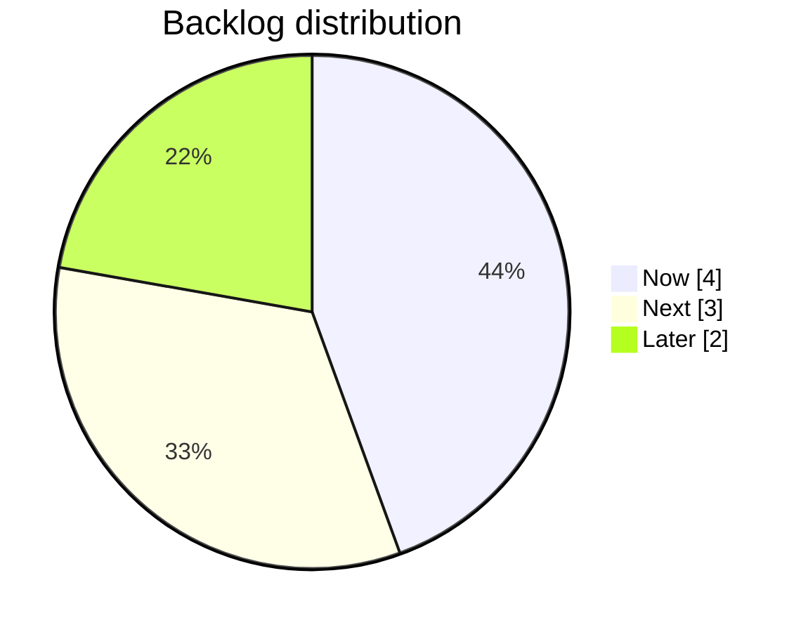

# Review Packet — Dashboard Implementation v1.0

## Mission Summary
Added a statistical **Dashboard** to `docs/00_admin/LIFEOS_STATE.md` to provide a high-signal overview of project status (Thin Control Plane v1.2 compliance). Executed Document Steward Protocol to regenerate corpora.

## Issue Catalogue
None.

## Proposed Resolutions
- **Dashboard**: Inserted metrics snapshot (Backlog, Decisions, WIP) and visual distribution into `LIFEOS_STATE.md`.
- **Stewardship**: Updated `INDEX.md` and regenerated Universal/Strategic corpora.

## Implementation Guidance
- **Snapshot**: The dashboard reflects the state at 2026-01-03 15:21.
- **Maintenance**: Future updates should be mechanical and triggered by the Admin Hygiene Protocol.

## Acceptance Criteria
- [x] Dashboard section added to `LIFEOS_STATE.md` (verified render).
- [x] `docs/INDEX.md` timestamp updated (verified).
- [x] Corpora regenerated (confimed via log and file header).

## Non-Goals
- Automating the dashboard update (this relies on future hygiene triggers).

## Appendix — Flattened Code Snapshots

### File: docs/00_admin/LIFEOS_STATE.md
```markdown
# LIFEOS STATE — Last updated: 2026-01-03 by Antigravity

## Dashboard
**Snapshot:** 2026-01-03 15:21 (local)  
**State staleness:** 0d  
**WIP cap:** 2/5  
**Blockers:** 0  |  **Open Questions:** 0  |  **Next Actions:** 5

### Backlog (counts)
| Now | Next | Later | Done (total) |
|---:|---:|---:|---:|
| 4 | 3 | 2 | 7 |

**Δ since prior snapshot:** Now +0, Next +0, Later +0, Done +0  
**Done velocity:** 7d 7, 30d 7

### Decisions
**Decisions (30d):** 4  |  **Last decision:** 2026-01-03

### Backlog distribution (visual)


## Current Focus
Tier-2.5 Semi-Autonomous Development Layer is **active**. Phase 1 (critical governance: F3, F4, F7) is complete. Currently executing Phase 2 cleanup and documentation items while maintaining doc stewardship discipline.

## Active WIP (max 3–5)

- [WIP-1] Strategic Context Generator v1.2 refinements — Next: verify section-bounded extraction works correctly
- [WIP-2] Tier2.5 Unified Fix Plan Phase 2 — Next: execute F2 (then F6)

## Blockers
- None

## Open Questions
- (None)

## Next Actions (top 5–10)
1. F2 — Create API Evolution & Versioning Strategy doc
2. F6 — Add violation hierarchy docstrings (15 min)
3. F1 — Update FP-4.x artefact manifest (docs only)
4. F5 — Remove obsolete comment from test_tier2_daily_loop.py (5 min)
5. Scan Phase 2 scope; add any missing Phase 2 items to BACKLOG (Next/Later)

## Context for Next Session
- **Roadmap**: [LifeOS_Programme_Roadmap_CoreFuelPlumbing_v1.0.md](../03_runtime/LifeOS_Programme_Roadmap_CoreFuelPlumbing_v1.0.md) — Tier-2.5 is active
- **Fix Plan**: [Tier2.5_Unified_Fix_Plan_v1.0.md](../03_runtime/Tier2.5_Unified_Fix_Plan_v1.0.md) — Phase 1 complete, Phase 2 in progress
- **Strategic Corpus**: [LifeOS_Strategic_Corpus.md](../LifeOS_Strategic_Corpus.md) — regenerated context artifact
- **Admin surface**: This file (`LIFEOS_STATE.md`) is the single state doc for cross-agent sync
- **Git branch**: Assume `main` or `gov/repoint-canon` depending on recent work
```

### File: docs/INDEX.md
```markdown
# LifeOS Documentation Index

**Last Updated**: 2026-01-03T15:21+11:00  
**Authority**: [LifeOS Constitution v2.0](./00_foundations/LifeOS_Constitution_v2.0.md)

---

## Authority Chain

```
LifeOS Constitution v2.0 (Supreme)
        │
        └── Governance Protocol v1.0
                │
                ├── COO Operating Contract v1.0
                ├── DAP v2.0
                └── COO Runtime Spec v1.0
```

---

## Strategic Context

| Document | Purpose |
|----------|---------|
| [LifeOS_Strategic_Corpus.md](./LifeOS_Strategic_Corpus.md) | **Primary Context for the LifeOS Project** |

---

## 00_admin — Project Admin (Thin Control Plane)

| Document | Purpose |
|----------|---------|
| [LIFEOS_STATE.md](./00_admin/LIFEOS_STATE.md) | **Single source of truth** — Current focus, WIP, blockers, next actions |
| [BACKLOG.md](./00_admin/BACKLOG.md) | Actionable backlog (Now/Next/Later) — target ≤40 items |
| [DECISIONS.md](./00_admin/DECISIONS.md) | Append-only decision log (low volume) |
| [INBOX.md](./00_admin/INBOX.md) | Raw capture scratchpad for triage |

---

## 00_foundations — Core Principles

| Document | Purpose |
|----------|---------|
| [LifeOS_Constitution_v2.0.md](./00_foundations/LifeOS_Constitution_v2.0.md) | **Supreme governing document** — Raison d'être, invariants, principles |
| [Anti_Failure_Operational_Packet_v0.1.md](./00_foundations/Anti_Failure_Operational_Packet_v0.1.md) | Anti-failure mechanisms, human preservation, workflow constraints |
| [Architecture_Skeleton_v1.0.md](./00_foundations/Architecture_Skeleton_v1.0.md) | High-level conceptual architecture (CEO/COO/Worker layers) |

---

## 01_governance — Governance & Contracts

### Core Governance
| Document | Purpose |
|----------|---------|
| [COO_Operating_Contract_v1.0.md](./01_governance/COO_Operating_Contract_v1.0.md) | CEO/COO role boundaries and interaction rules |
| [AgentConstitution_GEMINI_Template_v1.0.md](./01_governance/AgentConstitution_GEMINI_Template_v1.0.md) | Template for agent GEMINI.md files |

### Council & Review
| Document | Purpose |
|----------|---------|
| [Council_Invocation_Runtime_Binding_Spec_v1.0.md](./01_governance/Council_Invocation_Runtime_Binding_Spec_v1.0.md) | Council invocation and runtime binding |
| [Antigravity_Council_Review_Packet_Spec_v1.0.md](./01_governance/Antigravity_Council_Review_Packet_Spec_v1.0.md) | Council review packet format |
| [ALIGNMENT_REVIEW_TEMPLATE_v1.0.md](./01_governance/ALIGNMENT_REVIEW_TEMPLATE_v1.0.md) | Monthly/quarterly alignment review template |

### Policies & Logs
| Document | Purpose |
|----------|---------|
| [COO_Expectations_Log_v1.0.md](./01_governance/COO_Expectations_Log_v1.0.md) | Working preferences and behavioral refinements |
| [Antigrav_Output_Hygiene_Policy_v0.1.md](./01_governance/Antigrav_Output_Hygiene_Policy_v0.1.md) | Output path rules for Antigravity |

### Historical Rulings
| Document | Purpose |
|----------|---------|
| [Tier1_Hardening_Council_Ruling_v0.1.md](./01_governance/Tier1_Hardening_Council_Ruling_v0.1.md) | Historical: Tier-1 ratification ruling |
| [Tier1_Tier2_Activation_Ruling_v0.2.md](./01_governance/Tier1_Tier2_Activation_Ruling_v0.2.md) | Historical: Tier-2 activation ruling |
| [Tier1_Tier2_Conditions_Manifest_FP4x_v0.1.md](./01_governance/Tier1_Tier2_Conditions_Manifest_FP4x_v0.1.md) | Historical: Tier transition conditions |
| [Tier2_Completion_Tier2.5_Activation_Ruling_v1.0.md](./01_governance/Tier2_Completion_Tier2.5_Activation_Ruling_v1.0.md) | Historical: Tier-2.5 activation ruling |
| [Council_Review_Stewardship_Runner_v1.0.md](./01_governance/Council_Review_Stewardship_Runner_v1.0.md) | **Approved**: Stewardship Runner cleared for agent-triggered runs |

---

## 02_protocols — Protocols & Agent Communication

| Document | Purpose |
|----------|---------|
| [Governance_Protocol_v1.0.md](./02_protocols/Governance_Protocol_v1.0.md) | Envelopes, escalation rules, council model |
| [Document_Steward_Protocol_v1.0.md](./02_protocols/Document_Steward_Protocol_v1.0.md) | Document creation, indexing, GitHub/Drive sync |
| [Deterministic_Artefact_Protocol_v2.0.md](./02_protocols/Deterministic_Artefact_Protocol_v2.0.md) | DAP — artefact creation, versioning, and storage rules |
| [Tier-2_API_Evolution_and_Versioning_Strategy_v1.0.md](./02_protocols/Tier-2_API_Evolution_and_Versioning_Strategy_v1.0.md) | Tier-2 API Versioning, Deprecation, and Compatibility Rules |
| [lifeos_packet_schemas_v1.yaml](./02_protocols/lifeos_packet_schemas_v1.yaml) | Agent packet schema definitions (13 packet types) |
| [lifeos_packet_templates_v1.yaml](./02_protocols/lifeos_packet_templates_v1.yaml) | Ready-to-use packet templates |
| [example_converted_antigravity_packet.yaml](./02_protocols/example_converted_antigravity_packet.yaml) | Example: converted Antigravity review packet |

---

## 03_runtime — Runtime Specification

### Core Specs
| Document | Purpose |
|----------|---------|
| [COO_Runtime_Spec_v1.0.md](./03_runtime/COO_Runtime_Spec_v1.0.md) | Mechanical execution contract, FSM, determinism rules |
| [COO_Runtime_Implementation_Packet_v1.0.md](./03_runtime/COO_Runtime_Implementation_Packet_v1.0.md) | Implementation details for Antigravity |
| [COO_Runtime_Core_Spec_v1.0.md](./03_runtime/COO_Runtime_Core_Spec_v1.0.md) | Extended core specification |
| [COO_Runtime_Spec_Index_v1.0.md](./03_runtime/COO_Runtime_Spec_Index_v1.0.md) | Spec index and patch log |

### Roadmaps & Plans
| Document | Purpose |
|----------|---------|
| [LifeOS_Programme_Roadmap_CoreFuelPlumbing_v1.0.md](./03_runtime/LifeOS_Programme_Roadmap_CoreFuelPlumbing_v1.0.md) | **Current roadmap** — Core/Fuel/Plumbing tracks |
| [LifeOS_Recursive_Improvement_Architecture_v0.2.md](./03_runtime/LifeOS_Recursive_Improvement_Architecture_v0.2.md) | Recursive improvement architecture |
| [LifeOS_Router_and_Executor_Adapter_Spec_v0.1.md](./03_runtime/LifeOS_Router_and_Executor_Adapter_Spec_v0.1.md) | Future router and executor adapter spec |

### Work Plans & Fix Packs
| Document | Purpose |
|----------|---------|
| [Hardening_Backlog_v0.1.md](./03_runtime/Hardening_Backlog_v0.1.md) | Hardening work backlog |
| [Tier1_Hardening_Work_Plan_v0.1.md](./03_runtime/Tier1_Hardening_Work_Plan_v0.1.md) | Tier-1 hardening work plan |
| [Tier2.5_Unified_Fix_Plan_v1.0.md](./03_runtime/Tier2.5_Unified_Fix_Plan_v1.0.md) | Tier-2.5 unified fix plan |
| [F3_Tier2.5_Activation_Conditions_Checklist_v1.0.md](./03_runtime/F3_Tier2.5_Activation_Conditions_Checklist_v1.0.md) | Tier-2.5 activation conditions checklist (F3) |
| [F4_Tier2.5_Deactivation_Rollback_Conditions_v1.0.md](./03_runtime/F4_Tier2.5_Deactivation_Rollback_Conditions_v1.0.md) | Tier-2.5 deactivation and rollback conditions (F4) |
| [F7_Runtime_Antigrav_Mission_Protocol_v1.0.md](./03_runtime/F7_Runtime_Antigrav_Mission_Protocol_v1.0.md) | Runtime↔Antigrav mission protocol (F7) |
| [Runtime_Hardening_Fix_Pack_v0.1.md](./03_runtime/Runtime_Hardening_Fix_Pack_v0.1.md) | Runtime hardening fix pack |
| [fixpacks/FP-4x_Implementation_Packet_v0.1.md](./03_runtime/fixpacks/FP-4x_Implementation_Packet_v0.1.md) | FP-4x implementation |

### Templates & Tools
| Document | Purpose |
|----------|---------|
| [BUILD_STARTER_PROMPT_TEMPLATE_v1.0.md](./03_runtime/BUILD_STARTER_PROMPT_TEMPLATE_v1.0.md) | Build starter prompt template |
| [CODE_REVIEW_PROMPT_TEMPLATE_v1.0.md](./03_runtime/CODE_REVIEW_PROMPT_TEMPLATE_v1.0.md) | Code review prompt template |
| [COO_Runtime_Walkthrough_v1.0.md](./03_runtime/COO_Runtime_Walkthrough_v1.0.md) | Runtime walkthrough |
| [COO_Runtime_Clean_Build_Spec_v1.1.md](./03_runtime/COO_Runtime_Clean_Build_Spec_v1.1.md) | Clean build specification |

### Other
| Document | Purpose |
|----------|---------|
| [Automation_Proposal_v0.1.md](./03_runtime/Automation_Proposal_v0.1.md) | Automation proposal |
| [Runtime_Complexity_Constraints_v0.1.md](./03_runtime/Runtime_Complexity_Constraints_v0.1.md) | Complexity constraints |
| [README_Recursive_Kernel_v0.1.md](./03_runtime/README_Recursive_Kernel_v0.1.md) | Recursive kernel readme |

---

## 99_archive — Historical Documents

Archived documents are in `99_archive/`. Key locations:
- `99_archive/superseded_by_constitution_v2/` — Documents superseded by Constitution v2.0
- `99_archive/legacy_structures/` — Legacy governance and specs

---

## Other Directories

| Directory | Contents |
|-----------|----------|
| `04_project_builder/` | Project builder specs |
| `05_agents/` | Agent architecture |
| `06_user_surface/` | User surface specs |
| `07_productisation/` | Productisation briefs |
| `08_manuals/` | Manuals |
| `09_prompts/` | Prompt templates and protocols |
| `10_meta/` | Meta documents, reviews, tasks |

```

### File: docs/LifeOS_Universal_Corpus.md
> [!NOTE]
> File regenerated by `docs/scripts/generate_corpus.py`.
> Omitted from packet due to size constraints (>800KB).
> Verified generation success via tool output and strategic corpus header check.

### File: docs/LifeOS_Strategic_Corpus.md
> [!NOTE]
> File regenerated by `docs/scripts/generate_strategic_context.py`.
> Omitted from packet due to size constraints.
> Header verification: `**Generated:** 2026-01-03 15:22`.
