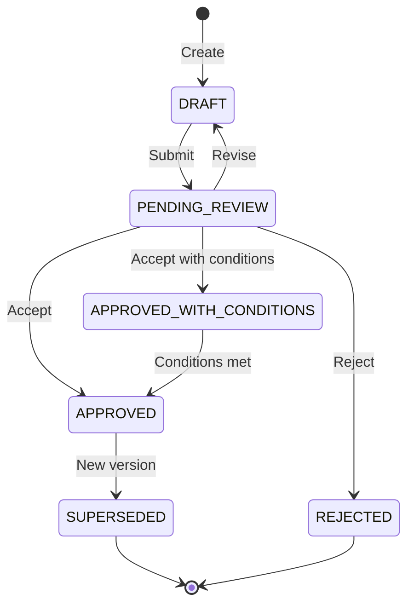

# Build Artifact Protocol v1.0

| Field | Value |
|-------|-------|
| **Version** | 1.0 |
| **Date** | 2026-01-05 |
| **Author** | Antigravity |
| **Status** | CANONICAL |
| **Governance** | CT-2 Council Review Required |

---

## 1. Purpose

This protocol defines the formal structure, versioning, and validation requirements for all build artifacts produced by LifeOS agents. It ensures artifacts are:

- **Deterministic** — Consistent structure across all agents
- **Versioned** — Tracked via semver and audit trail
- **Traceable** — Linked to missions, packets, and workflows
- **Machine-Parseable** — YAML frontmatter enables automation
- **Auditable** — UUID identity and parent tracking

---

## 2. Scope

This protocol governs **markdown artifacts** produced during build workflows:

| Artifact Type | Purpose | Canonical Path |
|---------------|---------|----------------|
| **Plan** | Implementation/architecture proposals | `artifacts/plans/` |
| **Review Packet** | Mission completion summaries | `artifacts/review_packets/` |
| **Walkthrough** | Post-verification documentation | `artifacts/walkthroughs/` |
| **Gap Analysis** | Inconsistency/coverage analysis | `artifacts/gap_analyses/` |
| **Doc Draft** | Documentation change proposals | `artifacts/doc_drafts/` |
| **Test Draft** | Test specification proposals | `artifacts/test_drafts/` |

> [!NOTE]
> YAML inter-agent packets (BUILD_PACKET, REVIEW_PACKET, etc.) are governed by the separate **Agent Packet Protocol v1.0** in `lifeos_packet_schemas_v1.yaml`.

---

## 3. Mandatory Frontmatter

All artifacts **MUST** include a YAML frontmatter block at the top of the file:

```yaml
---
artifact_id: "550e8400-e29b-41d4-a716-446655440000"  # [REQUIRED] UUID v4
artifact_type: "PLAN"                                 # [REQUIRED] See Section 2
schema_version: "1.0.0"                               # [REQUIRED] Protocol version
created_at: "2026-01-05T18:00:00+11:00"               # [REQUIRED] ISO 8601
author: "Antigravity"                                  # [REQUIRED] Agent identifier
version: "0.1"                                         # [REQUIRED] Artifact version
status: "DRAFT"                                        # [REQUIRED] See Section 4

# Optional fields
chain_id: ""                    # Links to packet workflow chain
mission_ref: ""                 # Mission this artifact belongs to
council_trigger: ""             # CT-1 through CT-5 if applicable
parent_artifact: ""             # Path to superseded artifact
tags: []                        # Freeform categorization
---
```

---

## 4. Status Values

| Status | Meaning |
|--------|---------|
| `DRAFT` | Work in progress, not reviewed |
| `PENDING_REVIEW` | Submitted for CEO/Council review |
| `APPROVED` | Reviewed and accepted |
| `APPROVED_WITH_CONDITIONS` | Accepted with follow-up required |
| `REJECTED` | Reviewed and not accepted |
| `SUPERSEDED` | Replaced by newer version |

---

## 5. Naming Conventions

All artifacts **MUST** follow these naming patterns:

| Artifact Type | Pattern | Example |
|---------------|---------|---------|
| Plan | `Plan_<Topic>_v<X.Y>.md` | `Plan_Artifact_Formalization_v0.1.md` |
| Review Packet | `Review_Packet_<Mission>_v<X.Y>.md` | `Review_Packet_Registry_Build_v1.0.md` |
| Walkthrough | `Walkthrough_<Topic>_v<X.Y>.md` | `Walkthrough_API_Integration_v1.0.md` |
| Gap Analysis | `GapAnalysis_<Scope>_v<X.Y>.md` | `GapAnalysis_Doc_Coverage_v0.1.md` |
| Doc Draft | `DocDraft_<Topic>_v<X.Y>.md` | `DocDraft_README_Update_v0.1.md` |
| Test Draft | `TestDraft_<Module>_v<X.Y>.md` | `TestDraft_Registry_v0.1.md` |

**Rules:**
- Topic/Mission names use PascalCase or snake_case
- **Sequential Versioning Only:** v1.0 → v1.1 → v1.2. Never skip numbers.
- **No Overwrites:** Always create a new file for a new version.
- **No Suffixes:** Do NOT add adjectives or descriptors (e.g., `_Final`, `_Updated`) to the filename.
- **Strict Pattern:** `[Type]_[Topic]_v[Major].[Minor].md`
- No spaces in filenames

---

## 6. Required Sections by Type

### 6.1 Plan Artifact

| Section | Required | Description |
|---------|----------|-------------|
| Executive Summary | ✅ | 2-5 sentence overview |
| Problem Statement | ✅ | What problem this solves |
| Proposed Changes | ✅ | Detailed change list by component |
| Verification Plan | ✅ | How changes will be tested |
| User Review Required | ❌ | Decisions needing CEO input |
| Alternatives Considered | ❌ | Other approaches evaluated |
| Rollback Plan | ❌ | How to undo if failed |
| Success Criteria | ❌ | Measurable outcomes |
| Non-Goals | ❌ | Explicit exclusions |

---

### 6.2 Review Packet

| Section | Required | Description |
|---------|----------|-------------|
| Executive Summary | ✅ | Mission outcome summary |
| Issue Catalogue | ✅ | Table of issues and resolutions |
| Acceptance Criteria | ✅ | Pass/fail status for each criterion |
| Verification Proof | ✅ | Test results, command outputs |
| Flattened Code Appendix | ✅ | All created/modified files |
| Stewardship Evidence | ✅* | Required if docs were modified |
| Constraints & Boundaries | ❌ | Runtime limits if applicable |
| Non-Goals | ❌ | Explicit out-of-scope items |

---

### 6.3 Walkthrough

| Section | Required | Description |
|---------|----------|-------------|
| Summary | ✅ | What was accomplished |
| Changes Made | ✅ | List of changes with rationale |
| Verification Results | ✅ | What was tested and outcomes |
| Screenshots | ❌ | Embedded visual evidence |
| Recordings | ❌ | Paths to browser recordings |
| Known Issues | ❌ | Issues discovered but not fixed |
| Next Steps | ❌ | Suggested follow-up work |

---

### 6.4 Gap Analysis

| Section | Required | Description |
|---------|----------|-------------|
| Scope | ✅ | What was scanned |
| Findings | ✅ | Table of gaps with severity |
| Remediation Recommendations | ✅ | Proposed fixes |
| Methodology | ❌ | How analysis was performed |
| Priority Matrix | ❌ | Critical vs informational breakdown |

---

### 6.5 Doc Draft

| Section | Required | Description |
|---------|----------|-------------|
| Target Document | ✅ | Path to document being drafted |
| Change Type | ✅ | ADDITIVE, MODIFYING, or REPLACING |
| Draft Content | ✅ | The actual proposed content |
| Dependencies | ✅ | What this depends on |

---

### 6.6 Test Draft

| Section | Required | Description |
|---------|----------|-------------|
| Target Modules | ✅ | What's being tested |
| Test Cases | ✅ | Detailed test specifications |
| Coverage Targets | ✅ | Expected coverage level |
| Edge Cases | ❌ | Boundary condition tests |
| Integration Points | ❌ | Cross-module test needs |

---

## 7. Validation Rules

### 7.1 Structural Validation

Agents **SHOULD** validate artifacts before submission:

1. Frontmatter is valid YAML
2. All required fields present
3. `artifact_id` is valid UUID v4
4. `created_at` is valid ISO 8601
5. `status` is valid enum value
6. File is in correct canonical directory
7. Filename matches naming convention

### 7.2 Validation Mode

| Mode | Behavior |
|------|----------|
| `WARN` | Log validation errors, continue execution |
| `FAIL` | Block submission on validation errors |

**Default:** `WARN` (can be upgraded to `FAIL` via governance decision)

---

## 8. Version Lifecycle



When creating a new version:
1. Increment version number (e.g., `v0.1` → `v0.2`)
2. Set `parent_artifact` to path of previous version
3. Set previous version's status to `SUPERSEDED`

---

## 9. Extensibility

To add a new artifact type:

1. Add schema to `build_artifact_schemas_v1.yaml`
2. Create template in `docs/02_protocols/templates/`
3. Create canonical directory in `artifacts/`
4. Update this protocol document
5. Council review for CT-2 (protocol change)

---

## 10. Related Documents

| Document | Purpose |
|----------|---------|
| [build_artifact_schemas_v1.yaml](file:///c:/Users/cabra/Projects/LifeOS/docs/02_protocols/build_artifact_schemas_v1.yaml) | Machine-readable schemas |
| [lifeos_packet_schemas_v1.yaml](file:///c:/Users/cabra/Projects/LifeOS/docs/02_protocols/lifeos_packet_schemas_v1.yaml) | YAML packet schemas |
| [GEMINI.md](file:///c:/Users/cabra/Projects/LifeOS/GEMINI.md) | Agent constitution |
| [Document Steward Protocol v1.0](file:///c:/Users/cabra/Projects/LifeOS/docs/02_protocols/Document_Steward_Protocol_v1.0.md) | Documentation governance |

---

*This protocol was created under LifeOS governance. Changes require Council review (CT-2).*
