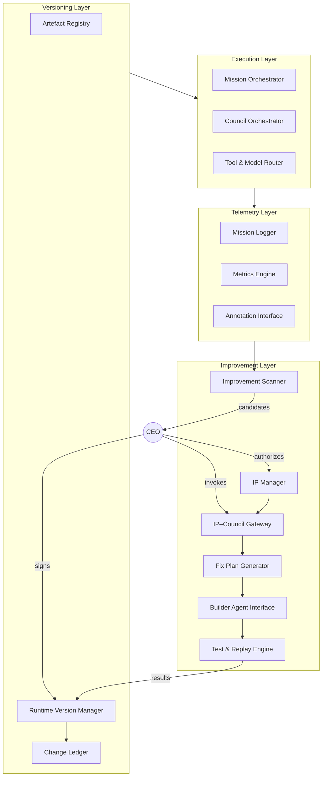
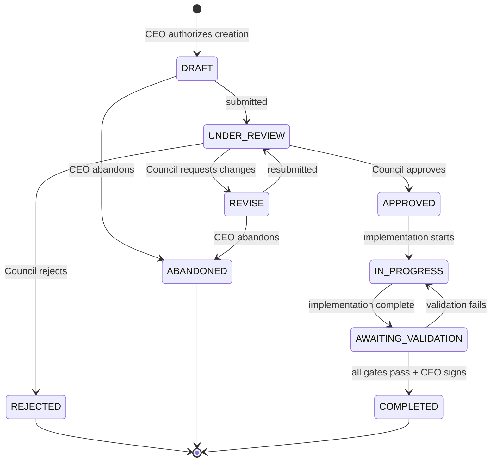
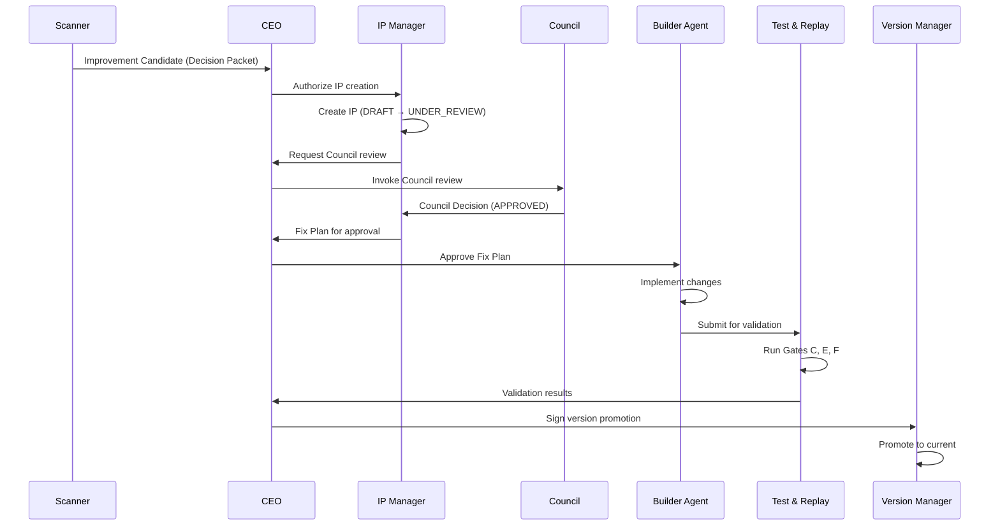

# LifeOS_Recursive_Improvement_Architecture_v0.2

**Version:** v0.2  
**Status:** Draft — incorporates Council and architect feedback from v0.1 review  
**Intended Placement:** `/LifeOS/docs/03_runtime/LifeOS_Recursive_Improvement_Architecture_v0.2.md`  
**Supersedes:** v0.1  

---

## 1. Purpose & Scope

This document defines the architecture for the **internal recursive self-improvement system** of LifeOS.

### 1.1 In Scope

- How the **COO Runtime** and associated internal frameworks (specs, protocols, prompts, tests) improve themselves over time.
- How to do this while preserving:
  - **Determinism** per runtime version.
  - **Auditability** of all changes.
  - **Governance** via Improvement Proposals (IPs) and the AI Council.

### 1.2 Out of Scope

- External "life" agents (e.g. trading bots, opportunity sniffers) except as missions executed by the runtime.
- Business/product roadmaps.
- The COO Runtime FSM itself (defined in COO Runtime Spec v1.0).
- Council Protocol internals (defined in Council_Invocation_Runtime_Binding_Spec_v1.0).

### 1.3 Goal

Create a **repeatable, governed improvement loop** around a deterministic core, not to make the core itself stochastic.

---

## 2. Authority & Binding

### 2.1 Subordination

This document is **subordinate** to:

1. LifeOS v1.1 (Supreme)
2. Alignment Layer v1.4
3. COO Runtime Spec v1.0
4. Council_Invocation_Runtime_Binding_Spec_v1.0

If any provision here conflicts with the above, the higher-level specification prevails.

### 2.2 CEO-Only Authority Invariant

> [!IMPORTANT]
> All judgment, discretion, and decision-making authority rests with the CEO.
> No component of this architecture may autonomously initiate governance actions.
> Any ambiguity MUST escalate via QUESTION → CEO.

This invariant is inherited from Alignment Layer v1.4 §1.2 and §1.4.

---

## 3. Design Principles

1. **Determinism per version**  
   - For any given runtime version:  
     `same inputs + same state → same outputs`.  
   - All LLM/tool calls are frozen under Freeze Protocol (Alignment Layer v1.4 §1.6) and replayable.

2. **Spec- and protocol-first**  
   - Behaviour is defined by explicit specs and protocols (LifeOS Core, COO Runtime spec, StepGate, Council Protocol, DAP, etc.).
   - Code, prompts, and workflows are implementations of those specs.

3. **Governed change only**  
   - No change to specs, runtime code, prompts, or core workflows occurs outside CEO-authorized governance:
     - CEO-authorized IP creation → Council review → Fix Plan → tests/replays → CEO-signed promotion.

4. **Full traceability**  
   - Every change is traceable back to:
     - Evidence and telemetry.
     - A specific IP.
     - Council decisions.
     - Test/replay results.
     - Version and commit references.

5. **Replayability**  
   - Past missions can be re-run against new runtime versions to:
     - Validate proposed changes.
     - Detect regressions.

6. **Separation of concerns**  
   - Execution, telemetry, improvement decision-making, and versioning are separated into distinct layers and components.

---

## 4. Layered Architecture Overview

The recursive improvement system is structured into four layers:

1. **Execution Layer (COO Runtime)**
2. **Telemetry & Evidence Layer**
3. **Improvement Layer**
4. **Versioning & Artefact Layer**

Recursive self-improvement emerges from **continuous interaction** between these layers, always under CEO governance.



---

## 5. Layer 1: Execution Layer Components

### 5.1 Mission Orchestrator (COO Runtime Core)

- Implements the **deterministic mission state machine** per COO Runtime Spec v1.0 §3.
- Reads the current runtime version (code/spec/prompt set) from the Versioning Layer.
- Executes missions under:
  - StepGate Protocol (`09_prompts/v1.0/protocols/stepgate_protocol_v1.0.md`).
  - Council invocation policies (Council_Invocation_Runtime_Binding_Spec_v1.0).
  - Tool/model routing policies.
- Ensures that all LLM calls:
  - Are performed via controlled paths.
  - Are frozen (AMU₀ snapshot, Freeze Protocol per Alignment Layer v1.4 §1.6).
  - Are recorded for replay.

### 5.2 Council Orchestrator (Preparation Harness)

> [!CAUTION]
> The Council Orchestrator does NOT autonomously run Council reviews.
> It ONLY prepares artefacts for CEO-initiated Council invocations.

**Responsibilities:**
- Given an input artefact (e.g. an IP, a spec change), prepares a **Council Review Packet** per Antigravity_Council_Review_Packet_Spec_v1.0.
- Formats role-specific prompts from the canonical prompt library.
- Waits for **CEO to invoke Council review** per Council_Invocation_Runtime_Binding_Spec_v1.0 §2.

**Prohibited actions:**
- May NOT invoke Council reviews autonomously.
- May NOT synthesize Council decisions—that is the Chair's role per CEO invocation.
- May NOT advance any StepGate gate without explicit CEO "go".

### 5.3 Tool & Model Router

- Reads model/tool configuration for the current runtime version.
- Routes calls to external LLMs/tools.
- Maintains deterministic boundary per COO Runtime Spec v1.0 §2:
  - Freezing outputs.
  - Logging all calls.
  - Ensuring no external network calls occur outside controlled paths.

---

## 6. Layer 2: Telemetry & Evidence Layer Components

### 6.1 Mission Logger

Records for each mission:
- Mission metadata (type, intent, timestamps—mocked if frozen).
- Full state transition history (including rollbacks and divergences).
- All frozen model outputs and tool results.
- Council invocations and decisions (if any).
- Human interventions (overrides, corrections, tags).

Guarantees that the mission trace is sufficient to:
- Replay the mission.
- Diagnose failures and friction.

### 6.2 Metrics & Aggregation Engine

Derives metrics from mission logs:

| Metric | Type | Description |
|--------|------|-------------|
| `mission_success_rate` | % | Missions completing without rollback |
| `avg_transitions_per_mission` | count | State transitions before completion |
| `rollback_rate` | % | Missions requiring rollback |
| `human_intervention_minutes` | time | CEO/human time per mission type |
| `council_escalation_rate` | % | Missions requiring Council review |
| `ip_cycle_time` | time | IP DRAFT → COMPLETED duration |
| `regression_detection_rate` | % | Regressions caught by Gate F |

Stores aggregated metrics in the Runtime DB for use by:
- The Improvement Scanner.
- Dashboards and reporting.
- CEO Decision Packets.

### 6.3 Annotation Interface (Human & System)

Provides a structured way for:
- **CEO/User** to tag missions and behaviours ("too much donkey work", "spec violation", "confusing output").
- **System detectors** to tag patterns (e.g. "repeated failure in Gate 3 for mission type X").

Normalises annotations into a standard format and writes them to the DB as **evidence records** (not candidates—see §7.1).

---

## 7. Layer 3: Improvement Layer Components

### 7.1 Improvement Scanner

**Function:** Periodically or event-driven scans of:
- Mission logs.
- Metrics.
- Annotations.

**Output:** Produces **Improvement Candidates** based on:
- Recurrent mission failures for specific mission types.
- High human intervention / friction.
- Anomalous metric trends.
- Frequent Council flags of spec violations.

**Candidate Structure:**
```
Improvement Candidate (Evidence Record)
├── candidate_id: UUID
├── created_at: timestamp
├── problem_class: enum (FAILURE_PATTERN, FRICTION, METRIC_ANOMALY, GOVERNANCE_FLAG)
├── severity: 1-5
├── affected_mission_types: [list]
├── example_missions: [list of mission_ids]
├── evidence_summary: text
├── status: PENDING_CEO_REVIEW
```

> [!IMPORTANT]
> **CEO Authorization Required.**
> Candidates are observations only. They are surfaced to the CEO via a CEO Decision Packet.
> The Scanner MUST NOT create IPs—only the IP Manager may do so after explicit CEO authorization.

**Flow:**
1. Scanner produces candidates.
2. Candidates surface in CEO Decision Packet.
3. CEO reviews and either:
   - Authorizes IP creation (→ IP Manager), or
   - Rejects/defers (candidate archived with reason).

### 7.2 IP Manager

Converts CEO-authorized candidates (and ad-hoc CEO ideas) into **Improvement Proposals (IPs)**.

**IP Lifecycle State Machine:**



**IP Schema (Core Tables):**

| Table | Purpose |
|-------|---------|
| `ip_proposals` | Core IP record: id, title, status, timestamps |
| `ip_evidence` | Links to source candidates/annotations |
| `ip_root_causes` | Optional root cause analysis |
| `ip_proposed_changes` | Artefacts to modify, modification type |
| `ip_test_plans` | Required tests, replay sets, acceptance criteria |
| `ip_council_reviews` | Council decision records (linked to Council Decision Records) |
| `ip_version_links` | Maps old → new artefact versions |
| `ip_events` | Full event log (transitions, annotations) |
| `ip_metrics` | Baseline vs observed metrics |

### 7.3 IP–Council Gateway

**Function:** Takes an IP in `UNDER_REVIEW` status and facilitates a Council review.

**Process:**
1. Prepares a Council Review Packet per Antigravity_Council_Review_Packet_Spec_v1.0.
2. Surfaces packet to CEO with recommendation for Council invocation.
3. **CEO invokes Council review** per Council_Invocation_Runtime_Binding_Spec_v1.0 §2 (trigger phrases or explicit request).
4. Council runs per existing protocol:
   - Architect: structural and architectural coherence.
   - Alignment: compliance with LifeOS core principles.
   - Risk: potential new failure modes/regressions.
   - Red-Team: adversarial scenarios.
   - Simplicity/Ops: operational complexity, overengineering.
5. Chair synthesizes outputs into Council Decision Record.
6. Gateway writes record to `ip_council_reviews`.
7. Updates IP status: `APPROVED` / `REJECTED` / `REVISE`.

> [!NOTE]
> The Gateway does NOT run Council autonomously. It prepares materials and waits for CEO invocation.

### 7.4 Fix Plan Generator

For IPs in `APPROVED` status, generates a **Fix Plan** specifying:

- **Exact artefacts to modify:**
  - Path.
  - Type (SPEC, CODE, PROMPT, TEST, WORKFLOW).
  - Current version.
  - Nature of modification (ADD, MODIFY, DELETE, REFACTOR).

- **Scope constraints:**
  - Files outside this list MUST NOT be modified.
  - Diff-based validation will flag out-of-scope changes.

- **Test plans:**
  - Unit test requirements.
  - Gate C, E, F requirements (explicit binding to COO Runtime Spec v1.0 §10).
  - Replay set selection criteria.

- **Baseline metrics:**
  - Current metric values to compare against post-implementation.

Writes to:
- `ip_proposed_changes`
- `ip_test_plans`
- `ip_metrics` (phase = BASELINE)

### 7.5 Builder Agent Interface (Antigravity Integration)

**Function:** Orchestrates external builder agents (Antigravity) according to Fix Plans.

**Provides:**
- Current artefacts.
- Fix Plan with clear, bounded instructions.
- Context and references.

**Receives:**
- Updated artefacts (specs, code, prompts, tests).
- Diff logs.

**Enforces:**

> [!IMPORTANT]
> **Scope Enforcement Required.**
> All Builder Agent outputs MUST:
> 1. Pass through Governance-Leak Scanner (Alignment Layer v1.4 §4).
> 2. Pass diff-based scope validation:
>    - Changes to artefacts NOT in Fix Plan → HALT → QUESTION to CEO.
>    - Changes to governance structures → HALT → QUESTION to CEO.

**Writes:**
- Updated artefact versions to repository.
- `ip_version_links` (old version → new version mapping).

### 7.6 Test & Replay Engine

**Function:** Validates candidate runtime versions created by Fix Plans.

**Executes (bound to COO Runtime Spec v1.0 §10):**

| Gate | Validation |
|------|------------|
| Gate C | Test Suite Integrity — full test suite, zero skipped, zero nondeterministic |
| Gate E | Governance Integrity — lint + governance-leak scanner |
| Gate F | Replay Determinism — AMU₀-locked context, byte-identical comparison |

Plus:
- Unit test suites specified in `ip_test_plans`.
- Replays of selected historical missions per selection criteria.

**Mission Replay Selection:**
- Default: 5 most recent missions + 3 highest-friction missions (by annotation count).
- CEO may specify additional missions or override selection.

**Produces:**
- Pass/fail results per gate.
- Observed metrics (`ip_metrics` with phase = OBSERVED).
- Variance analysis (baseline vs observed).

**Failure Protocol:**
- Any gate failure → IP status remains `AWAITING_VALIDATION`.
- Failure details logged to `ip_events`.
- CEO Decision Packet generated with failure analysis.
- CEO decides: retry, revise Fix Plan, or abandon IP.

---

## 8. Layer 4: Versioning & Artefact Layer Components

### 8.1 Artefact Registry

Maintains a canonical catalogue of all versioned artefacts:

| Artefact Type | Examples |
|---------------|----------|
| SPEC | LifeOS Core, COO Runtime, StepGate, Council Protocol, DAP |
| CODE | Runtime modules, scanner, IP Manager |
| PROMPT | Council roles, mission templates |
| TEST | Unit tests, integration tests, replay fixtures |
| WORKFLOW | StepGate sequences, IP lifecycle |

**Entry Structure:**
```
artefact_id: UUID
logical_path: string (e.g. "/docs/03_runtime/COO_Runtime_Spec_v1.0.md")
version: semver (vX.Y)
type: enum (SPEC, CODE, PROMPT, TEST, WORKFLOW)
sha256: hash of content
git_commit: optional commit reference
created_at: timestamp
supersedes: optional artefact_id (previous version)
ip_link: optional ip_id (IP that created this version)
```

### 8.2 Runtime Version Manager

Manages **runtime versions** (e.g. `coo-runtime v1.3`).

**For each runtime version, defines:**
- The set of artefact versions composing it.
- Default model/tool configuration.
- Applicable policies (e.g. which Council roles to use by default).

**Promotion Protocol:**

1. Candidate runtime version created from IP artefact updates.
2. Test & Replay Engine validates (Gates C, E, F pass).
3. **CEO reviews validation results.**
4. **CEO signs promotion** (cryptographic signature).
5. Candidate becomes "current".
6. Change Ledger records promotion.
7. Previous version retained for replay and rollback.

### 8.3 Change Ledger

Records every significant change event:

| Event Type | Data |
|------------|------|
| IP_CREATED | ip_id, candidate_id, CEO authorization ref |
| IP_STATE_CHANGE | ip_id, from_state, to_state, actor, reason |
| COUNCIL_DECISION | ip_id, decision_record_id, verdict |
| ARTEFACT_VERSION | artefact_id, old_version, new_version, ip_id |
| RUNTIME_PROMOTED | runtime_version, artefact_manifest, CEO signature |
| RUNTIME_ROLLBACK | from_version, to_version, reason, CEO authorization |
| GATE_RESULT | runtime_version, gate, pass/fail, details |

Enables:
- Full auditability.
- Reconstruction of the system's evolution.
- Rollback point identification.

---

## 9. CEO Checkpoints

The following points require explicit CEO action (authorization, decision, or signature):

| Checkpoint | Action | Reference |
|------------|--------|-----------|
| **CP-1: Candidate → IP** | CEO authorizes IP creation from candidate | §7.1 |
| **CP-2: Council Invocation** | CEO invokes Council review | §7.3, Council_Invoke v1.0 §2 |
| **CP-3: Fix Plan Approval** | CEO approves Fix Plan before implementation | §7.4 |
| **CP-4: Scope Violation** | CEO decides on out-of-scope changes detected | §7.5 |
| **CP-5: Validation Failure** | CEO decides retry/revise/abandon | §7.6 |
| **CP-6: Version Promotion** | CEO signs new runtime version | §8.2 |
| **CP-7: Rollback Authorization** | CEO authorizes rollback (beyond first automatic) | §10 |

---

## 10. Rollback Protocol

### 10.1 Mission-Level Rollback

Per COO Runtime Spec v1.0 §12:
- Rollback to AMU₀ restores filesystem, database, sandbox, manifests.
- 1 automatic rollback permitted; further require CEO authorization.

### 10.2 IP-Level Rollback

If an IP is partially implemented then fails validation:

1. Candidate artefacts are NOT promoted to registry.
2. IP status set to `IN_PROGRESS` with failure annotation.
3. CEO decides:
   - **Retry:** Fix issues, re-run validation.
   - **Revise:** Return to `REVISE` for new Fix Plan.
   - **Abandon:** Mark IP `ABANDONED`.

### 10.3 Runtime Version Rollback

If a promoted runtime version is later found defective:

1. CEO authorizes rollback to previous runtime version.
2. Runtime Version Manager restores previous version as "current".
3. Offending IP is marked `ROLLED_BACK` with linked evidence.
4. New IP MUST be created to address the root cause (linked to original).
5. Change Ledger records: `RUNTIME_ROLLBACK` event with full context.
6. Rollback count limits apply per COO Runtime Spec v1.0 §12.

---

## 11. Primary Data Stores

1. **Runtime Database (SQLite)**
   - Mission and state tables.
   - Logs and annotations.
   - Metrics and aggregations.
   - IP tables (proposals, evidence, reviews, test plans, metrics, events, version links).
   - Candidate tables.
   - Version and configuration metadata.

2. **Artefact Repository**
   - Filesystem, Git-backed.
   - Stores content of specs, code, prompts, tests, replay fixtures.
   - Linked to Runtime DB via Artefact Registry and `ip_version_links`.

3. **Model & Tool Configuration Store**
   - Static configuration files (YAML/JSON) versioned with the runtime.
   - Describes available models/tools and routing policies.

---

## 12. Key Flows

### 12.1 Normal Mission Execution Flow

1. **Mission creation** — Orchestrator reads current runtime version, loads policies.
2. **Execution** — Deterministic state machine, Council invoked as needed (CEO-triggered).
3. **Telemetry capture** — Logger records trace, Metrics Engine updates, annotations added.
4. **Completion** — Result stored, trace available for replay.

### 12.2 Self-Improvement (IP) Flow



---

## 13. Determinism & Governance Invariants

The architecture enforces:

1. **Determinism per version** — Fixed runtime version = deterministic behaviour; all stochastic calls frozen.

2. **No ungoverned self-modification** — Any change requires:
   - IP creation (CEO-authorized).
   - Council review (CEO-invoked).
   - Validation (Gates C, E, F).
   - Promotion (CEO-signed).

3. **Replayability** — Past missions re-runnable against original or new versions.

4. **Traceable evolution** — Any version traceable to IPs, Council decisions, tests, CEO signatures.

5. **CEO-only authority** — All decision points require CEO action; no autonomous governance.

---

## 14. MVP Scope

For the first full recursive improvement cycle:

| Component | MVP Status | Notes |
|-----------|------------|-------|
| Mission Logger | ✅ Exists | COO Runtime implementation |
| Metrics Engine | ✅ Minimal | Export to CSV/JSON for CEO review |
| Annotation Interface | ✅ Minimal | CLI tag command |
| Improvement Scanner | ⚠️ Manual | CEO reviews logs/metrics directly |
| IP Manager | ✅ Core | Lifecycle engine required |
| IP–Council Gateway | ⚠️ Partial | Reuse existing Council Protocol |
| Fix Plan Generator | ✅ Template | Structured markdown template |
| Builder Agent Interface | ✅ Exists | Antigravity |
| Test & Replay Engine | ✅ Exists | Gate F harness |
| Artefact Registry | ⚠️ Git-based | Git + manifest file |
| Runtime Version Manager | ⚠️ Manual | Git tags + manual changelog |
| Change Ledger | ⚠️ Git-based | Git log + structured CHANGELOG.md |

**Minimal Loop:**
1. CEO reviews mission logs, identifies issue.
2. CEO creates IP (via IP Manager or structured template).
3. CEO invokes Council review (existing protocol).
4. Council produces Fix Plan.
5. Antigravity implements.
6. Gate C + F validation.
7. CEO signs off on version bump.

---

## 15. Version History

| Version | Date | Changes |
|---------|------|---------|
| v0.1 | 2025-12 | Initial draft |
| v0.2 | 2025-12-08 | Incorporated review feedback: added CEO checkpoints, bound to existing protocols, clarified Council Orchestrator limitations, added IP lifecycle state machine, defined rollback semantics, added metrics schema, defined MVP scope |

---

## 16. Open Questions (For CEO Decision)

1. **Replay Set Selection:** CEO-curated list vs algorithmic selection (most recent + highest friction)?

2. **Council Role Subset:** Full role set for all IPs, or risk-based reduction for low-impact changes?

3. **Automatic Rollback Scope:** Should first automatic rollback apply only to mission-level, or also to validation failures?

---

**End of document.**
