> [!NOTE]
> **STATUS**: Non-Canonical (Information Only). This document is provided for context and architectural reference but is not an authoritative specification.

# LifeOS Architecture Diagrams

**Generated:** 2026-01-28 00:35 AEDT  
**Purpose:** Visual system architecture and agent interaction flows

---

## 1. Current System Architecture (As-Is)

### 1.1 High-Level Component View

```mermaid
graph TB
    subgraph "External Layer"
        USER[👤 User / CEO]
        OPENCODE[OpenCode<br/>Autonomous Agent]
        ANTIGRAVITY[Antigravity<br/>Interactive Agent]
    end
    
    subgraph "LifeOS Runtime"
        CLI[CLI Interface<br/>runtime/cli.py]
        AGENTS[Agent API Layer<br/>runtime/agents/]
        ORCH[Orchestration Engine<br/>runtime/orchestration/]
        GOV[Governance Layer<br/>runtime/governance/]
        SAFETY[Safety Gates<br/>runtime/safety/]
        STATE[State Store<br/>runtime/state/]
    end
    
    subgraph "Persistence"
        GIT[Git Repository<br/>Source of Truth]
        DOCS[Documentation<br/>docs/]
        ARTIFACTS[Evidence Store<br/>artifacts/]
    end
    
    USER -->|Commands| CLI
    USER -->|Manual Orchestration<br/>"Waterboy Mode"| OPENCODE
    USER -->|Interactive Sessions| ANTIGRAVITY
    
    CLI --> AGENTS
    AGENTS --> ORCH
    ORCH --> GOV
    GOV --> SAFETY
    
    ORCH --> STATE
    STATE --> GIT
    ORCH --> ARTIFACTS
    DOCS -.Governance Rules.-> GOV
    
    style USER fill:#95e1d3
    style OPENCODE fill:#ffd93d
    style ANTIGRAVITY fill:#ffd93d
```

---

### 1.2 Runtime Module Structure


---

## 2. Agent Interaction Flows (Current State)

### 2.1 Manual "Waterboy" Mode (Current Problem)

```mermaid
sequenceDiagram
    participant CEO as 👤 CEO<br/>(Waterboy)
    participant Designer as Designer Agent
    participant Builder as Builder Agent
    participant Council as Council Review<br/>(Manual)
    
    Note over CEO: Has high-level intent
    CEO->>Designer: "Design this feature"
    Designer->>CEO: Design response (YAML)
    
    Note over CEO: Manually transfers context
    CEO->>Builder: "Build per this design"
    Builder->>CEO: Implementation + evidence
    
    Note over CEO: Manually orchestrates review
    CEO->>Council: "Review this build"
    Note over Council: CEO runs multiple models<br/>manually, consolidates
    Council->>CEO: Review feedback
    
    Note over CEO: Manually decides next step
    CEO->>Builder: "Fix these issues"
    Builder->>CEO: Updated implementation
    
    Note over CEO,Builder: CEO is the critical path<br/>Can't scale, bottleneck
```



**Problem:** CEO manually shuttles context between agents (waterboy mode)

---

### 2.2 Target State: Autonomous Agent Flow

```mermaid
sequenceDiagram
    participant CEO as 👤 CEO
    participant Orch as Orchestrator Agent
    participant Designer as Designer Agent
    participant Builder as Builder Agent
    participant Council as Council Agent
    participant Evidence as Evidence Store
    
    CEO->>Orch: "Build feature X"
    Note over Orch: Creates task plan<br/>Tracks state
    
    Orch->>Designer: Design request + context
    Designer->>Orch: Design response
    Orch->>Evidence: Store design
    
    Orch->>Builder: Build request + design
    Builder->>Orch: Implementation + evidence
    Orch->>Evidence: Store build artifacts
    
    Orch->>Council: Review request + CCP
    Note over Council: Runs 9-seat review<br/>Autonomous
    Council->>Orch: Verdict + Fix Plan
    
    alt Verdict: PASS
        Orch->>CEO: ✅ "Feature complete"
    else Verdict: FIX
        Orch->>Builder: "Apply fixes"
        Builder->>Orch: Fixed implementation
        Orch->>Council: Re-review
    else Verdict: REJECT
        Orch->>CEO: ⚠️ "Needs CEO decision"
    end
    
    Note over CEO: Async oversight<br/>Intervenes by exception
```



**Benefit:** CEO sets intent, agents execute, CEO reviews async

---

## 3. Council Agent Architecture (Planned)

### 3.1 Council Agent Internal Structure


---

### 3.2 Council Review Workflow (M2_FULL)


---

## 4. Orchestrator Agent Architecture (Planned)

### 4.1 Orchestrator Internal Structure


---

### 4.2 Multi-Step Build Workflow


---

## 5. Data Flow Architecture

### 5.1 Evidence & Audit Trail Flow


---

## 6. Tier Architecture (LifeOS Layers)

### 6.1 Tier Structure


**Current Status:**
- ✅ Tier 1: Complete (Foundation operational)
- ✅ Tier 2: Mostly complete (Governance operational, agents external)
- ⏳ Tier 3: In progress (Council Agent building, Orchestrator planned)

---

## 7. Deployment Architecture

### 7.1 Execution Environments


---

## 8. Integration Points

### 8.1 External Tool Integration


---

## 9. Security & Governance Boundaries


---

## 10. Roadmap: Current → Target State


---

**Maintained in:** `/home/cabra/clawd/lifeos/docs/11_admin/ARCHITECTURE_DIAGRAMS.md`  
**Format:** Mermaid (visual rendering)  
**Last Updated:** 2026-01-28 00:35 AEDT
