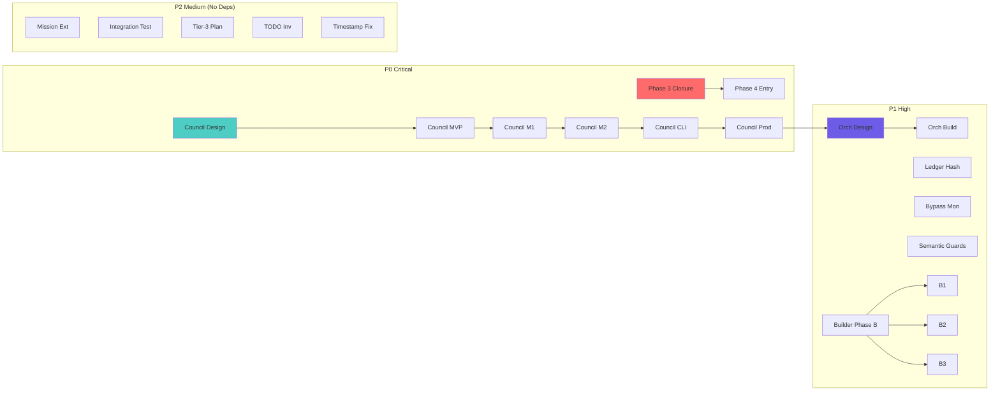
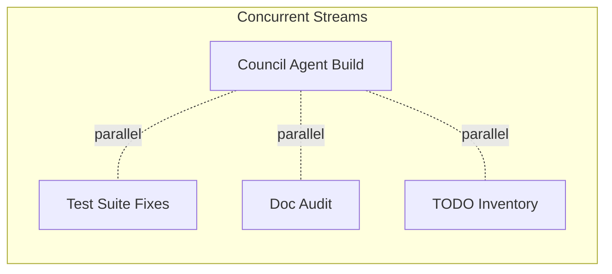
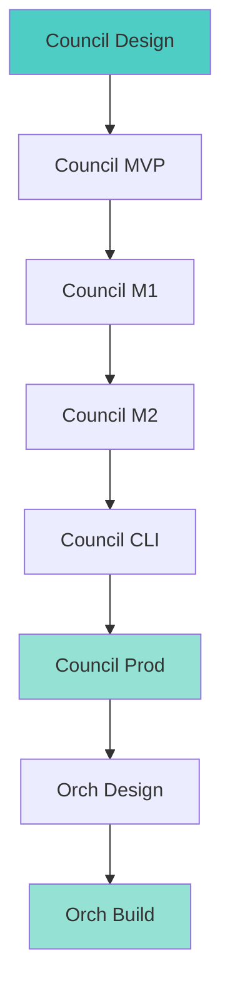
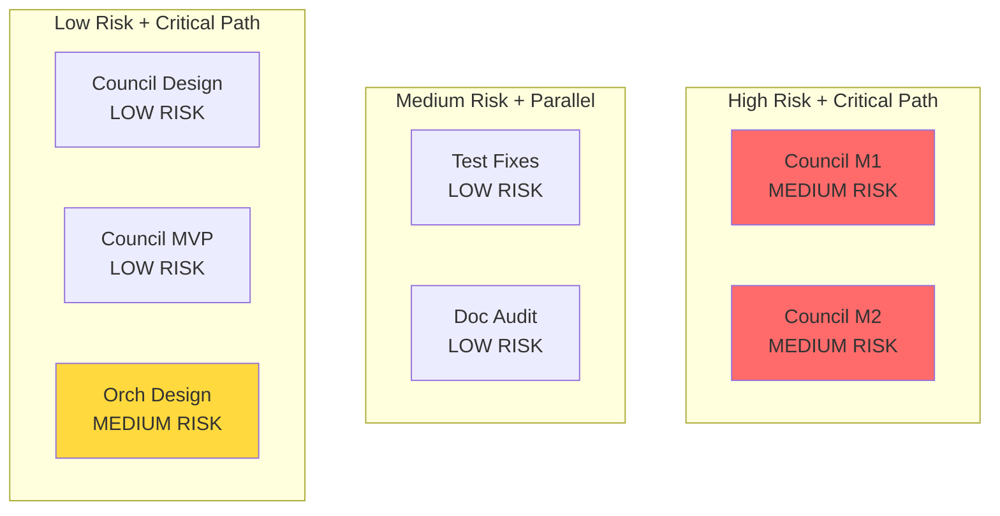

> [!NOTE]
> **STATUS**: Non-Canonical (Information Only). This document is provided for context and architectural reference but is not an authoritative specification.

# LifeOS Project Dependency Graph

**Generated:** 2026-01-28 00:30 AEDT  
**Purpose:** Visual critical path and dependency tracking

---

## Critical Path Dependencies

```mermaid
graph TD
    subgraph "Phase Management"
        P3[P0-001: Phase 3 Closure<br/>CRITICAL] --> P4[P0-002: Phase 4 Entry]
    end
    
    subgraph "Council Agent Build"
        CD[P0-010: Council Design<br/>IN PROGRESS 40%] --> CM0[P0-011: MVP M0_FAST<br/>2 days]
        CM0 --> CM1[P0-012: M1_STANDARD<br/>2 days]
        CM1 --> CM2[P0-013: M2_FULL<br/>1 day]
        CM2 --> CCLI[P0-014: CLI Integration<br/>0.5 days]
        CCLI --> CPROD[P0-015: Production<br/>0.5 days]
        CPROD -->|"MILESTONE:<br/>Exit Waterboy"| M1[🎯 Waterboy Exit]
    end
    
    subgraph "Orchestrator Agent"
        CPROD --> OD[P1-032: Orchestrator Design<br/>2 days]
        OD --> OB[P1-033: Orchestrator Build<br/>3 days]
        OB -->|"MILESTONE:<br/>Rung 2"| M2[🎯 Supervised Chains]
    end
    
    subgraph "Operations (Parallel)"
        TEST[P1-031: Test Suite Fixes<br/>ONGOING]
        DOC[P1-030: Doc Audit<br/>2 days]
        TODO[P2-021: TODO Inventory<br/>0.5 days]
        TS[P2-022: Timestamp Fix<br/>0.5 days]
    end
    
    style P3 fill:#ff6b6b
    style CD fill:#4ecdc4
    style M1 fill:#95e1d3
    style M2 fill:#95e1d3
    style TEST fill:#ffd93d
    style DOC fill:#ffd93d
```



---

## Full Dependency Matrix



---

## Dependency Table

| Task ID | Task Name | Depends On | Blocks | Est (days) |
|---------|-----------|------------|--------|------------|
| **P0-001** | Phase 3 Closure | — | P0-002 | 3 |
| **P0-002** | Phase 4 Entry | P0-001 | — | 0 |
| **P0-010** | Council Design | — | P0-011 | 1 |
| **P0-011** | Council MVP | P0-010 | P0-012 | 2 |
| **P0-012** | Council M1 | P0-011 | P0-013 | 2 |
| **P0-013** | Council M2 | P0-012 | P0-014 | 1 |
| **P0-014** | Council CLI | P0-013 | P0-015 | 0.5 |
| **P0-015** | Council Prod | P0-014 | P1-032 | 0.5 |
| **P1-032** | Orch Design | P0-015 | P1-033 | 2 |
| **P1-033** | Orch Build | P1-032 | — | 3 |
| **P1-031** | Test Fixes | — | — | 2 |
| **P1-030** | Doc Audit | — | — | 2 |
| **P2-021** | TODO Inv | — | — | 0.5 |
| **P2-022** | Timestamp Fix | — | — | 0.5 |

---

## Parallel vs Sequential Work

### Can Run in Parallel


**Independent Tasks:**
- Test suite fixes (P1-031)
- Doc audit (P1-030)
- TODO inventory (P2-021)
- Timestamp fix (P2-022)
- All Trusted Builder tasks (P1-001 to P1-003)
- All Builder Phase B tasks (P1-010 to P1-013)
- All doc finalization tasks (P1-020 to P1-025)

### Must Be Sequential


---

## Critical Path Analysis

**Longest Path (Days):**
```
Council Design (1) 
→ MVP (2) 
→ M1 (2) 
→ M2 (1) 
→ CLI (0.5) 
→ Prod (0.5) 
→ Orch Design (2) 
→ Orch Build (3)

Total: 12 days
```

**Parallel Work Capacity:**
```
Critical path: 12 days
With parallel work: 12 days (critical path unchanged)
Parallel savings: ~10 days of work done simultaneously
```

---

## Bottleneck Analysis

### Current Bottlenecks

1. **Council Agent Design (P0-010)** — Currently at 40%
   - **Impact:** Blocks entire Council build chain
   - **Mitigation:** Prioritize completion tonight, CEO Q1-Q4 decisions
   - **Risk:** LOW (design mostly complete, CEO engaged)

2. **Council MVP → M1 → M2 Chain** — Sequential by nature
   - **Impact:** 5.5 days of sequential work
   - **Mitigation:** Incremental delivery, test at each stage
   - **Risk:** MEDIUM (complexity, modal implementation)

3. **Orchestrator Depends on Council** — Can't start until Council complete
   - **Impact:** 5 days of work can't start early
   - **Mitigation:** Use Council learnings to inform design
   - **Risk:** LOW (intentional sequence, reduces rework)

### Resolved Bottlenecks

- ✅ **Web search capability** — Resolved 2026-01-27
- ✅ **Project tracking** — Resolved 2026-01-28 (this doc)
- ✅ **F3/F4/F7 specs** — Located 2026-01-27

---

## Risk-Dependency Matrix



**Priority:** Focus on high-risk + critical path items first.

---

## Milestone Dependencies

```mermaid
graph LR
    M0[🎯 Project Admin<br/>Complete] --> M1[🎯 Council Design<br/>Complete]
    M1 --> M2[🎯 Council MVP<br/>Working]
    M2 --> M3[🎯 Council M1<br/>Working]
    M3 --> M4[🎯 Council Production<br/>Waterboy Exit]
    M4 --> M5[🎯 Orch Design<br/>Complete]
    M5 --> M6[🎯 Orch Build<br/>Complete]
    M6 --> M7[🎯 Rung 2<br/>ACHIEVED]
    
    style M0 fill:#95e1d3
    style M4 fill:#95e1d3
    style M7 fill:#95e1d3
```



---

## What-If Scenarios

### Scenario 1: Phase 3 Closure Delayed
**Impact:** Phase 4 entry delayed, but Council Agent NOT blocked  
**Critical Path:** Unchanged (Council Agent independent)  
**Action:** Continue Council Agent build, Phase 4 waits

### Scenario 2: Council M1/M2 Takes Longer
**Impact:** Waterboy exit delayed, Orchestrator start delayed  
**Critical Path:** Extended by delay days  
**Action:** Adjust timeline, deliver M0_FAST faster to show progress

### Scenario 3: CEO Unavailable for Q1-Q4
**Impact:** Council Design complete with defaults, refine later  
**Critical Path:** Minimal (non-blocking questions)  
**Action:** Proceed with recommendations, note "pending CEO confirmation"

### Scenario 4: Test Suite Issues Block CI
**Impact:** Parallel work, doesn't block Council  
**Critical Path:** Unchanged  
**Action:** Fix incrementally, doesn't gate Council Agent

---

## Next Review Triggers

**Update this graph when:**
- ✅ Task status changes (todo → in progress → done)
- ✅ New dependencies discovered
- ✅ Blockers resolved or emerge
- ✅ Timeline estimates adjust
- ✅ New tasks added to backlog

**Review Frequency:** Daily (automated heartbeat)

---

**Maintained in:** `/home/cabra/clawd/lifeos/docs/11_admin/PROJECT_DEPENDENCY_GRAPH.md`  
**Format:** Mermaid (visual rendering)  
**Last Updated:** 2026-01-28 00:30 AEDT
