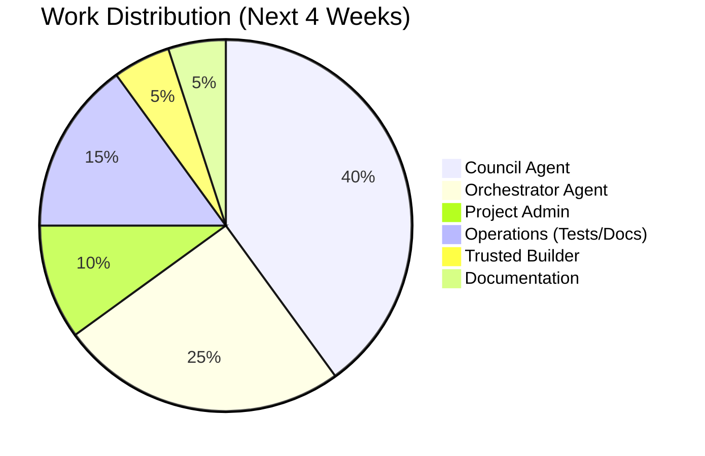

# LifeOS Project Gantt Chart

**Generated:** 2026-01-28 00:25 AEDT  
**Timeline:** Next 4 weeks (through Phase 4 entry + Rung 2)

---

## Timeline View (Mermaid)

```mermaid
gantt
    title LifeOS Project Timeline (2026-01-28 to 2026-02-25)
    dateFormat YYYY-MM-DD
    axisFormat %m/%d
    
    section Critical Path
    Phase 3 Closure                 :crit, p3close, 2026-01-28, 3d
    Phase 4 Entry                   :milestone, after p3close, 0d
    Council Agent Design            :active, council_design, 2026-01-28, 1d
    Council Agent MVP (M0)          :council_m0, after council_design, 2d
    Council Agent M1                :council_m1, after council_m0, 2d
    Council Agent M2 + CLI          :council_m2, after council_m1, 2d
    Council Production Deploy       :milestone, after council_m2, 0d
    Orchestrator Design             :orch_design, after council_m2, 2d
    Orchestrator Build              :orch_build, after orch_design, 3d
    Rung 2 Achieved                 :milestone, after orch_build, 0d
    
    section Council Agent
    Design v1.0 (40%)               :active, c_design, 2026-01-28, 1d
    MVP M0_FAST                     :c_mvp, after c_design, 2d
    M1_STANDARD                     :c_m1, after c_mvp, 2d
    M2_FULL                         :c_m2, after c_m1, 1d
    CLI Integration                 :c_cli, after c_m2, 0.5d
    Production Deploy               :c_prod, after c_cli, 0.5d
    
    section Orchestrator
    Design (Manager-Led)            :o_design, after c_prod, 2d
    CCP Parser + Dispatcher         :o_parser, after o_design, 1d
    Handoff Manager                 :o_handoff, after o_parser, 1d
    State Tracker                   :o_state, after o_handoff, 1d
    Integration Testing             :o_test, after o_state, 1d
    Production                      :o_prod, after o_test, 1d
    
    section Project Admin
    Master Task List                :done, admin_tasks, 2026-01-28, 0.5d
    Gantt Chart                     :done, admin_gantt, 2026-01-28, 0.5d
    Dependency Graph                :admin_deps, 2026-01-28, 0.5d
    Architecture Diagrams           :admin_arch, 2026-01-28, 1d
    
    section Operations (Parallel)
    Test Suite Fixes                :test_fixes, 2026-01-28, 7d
    Doc Status Audit                :doc_audit, 2026-01-29, 2d
    TODO Inventory                  :todo_inv, 2026-01-30, 0.5d
    Timestamp Fix Script            :timestamp, 2026-01-30, 0.5d
    
    section Trusted Builder (Antigravity)
    Ledger Hash Chain               :tb_ledger, 2026-02-03, 3d
    Bypass Monitoring               :tb_bypass, 2026-02-06, 2d
    Semantic Guardrails             :tb_semantic, 2026-02-08, 2d
    
    section Recursive Builder (Antigravity)
    Phase B Refinement              :rb_b, 2026-02-10, 5d
    B1: Evidence Assertions         :rb_b1, 2026-02-10, 2d
    B2: Exception Specificity       :rb_b2, 2026-02-12, 1d
    B3: Filesystem Boundary         :rb_b3, 2026-02-13, 2d
    
    section Documentation (Antigravity)
    Emergency Protocol v1.0         :doc_emergency, 2026-02-15, 1d
    Intent Routing v1.0             :doc_intent, 2026-02-16, 1d
    Test Protocol v2.0              :doc_test, 2026-02-17, 1d
    Tier Definition v1.1            :doc_tier, 2026-02-18, 1d
    ARTEFACT_INDEX v1.0             :doc_index, 2026-02-19, 1d
    QUICKSTART v1.0                 :doc_quick, 2026-02-20, 1d
```

---

## Milestones

| Date | Milestone | Description |
|------|-----------|-------------|
| **2026-01-28** | Project Admin Complete | Task lists, Gantt, diagrams ready |
| **2026-01-29** | Council Agent Design Complete | Full spec with CEO Q1-Q4 resolved |
| **2026-01-31** | Council Agent MVP | M0_FAST working end-to-end |
| **2026-01-31** | Phase 3 Closure | CEO sign-off, Phase 4 entry |
| **2026-02-03** | Council Agent M1 | Multi-seat, single model working |
| **2026-02-05** | Council Agent Production | CEO exits waterboy mode for reviews |
| **2026-02-07** | Orchestrator Design Complete | Manager-Led pattern specified |
| **2026-02-12** | Orchestrator MVP | Basic dispatch working |
| **2026-02-14** | Rung 2 Achieved | Supervised chains operational |

---

## Critical Path (Dates)

```
2026-01-28: Council Agent Design start
↓ 1 day
2026-01-29: Design complete, MVP start
↓ 2 days
2026-01-31: MVP complete, M1 start (+ Phase 3 closure target)
↓ 2 days
2026-02-02: M1 complete, M2 start
↓ 2 days
2026-02-04: M2 + CLI complete
↓ 1 day
2026-02-05: Council Agent PRODUCTION ✅
↓ 2 days
2026-02-07: Orchestrator Design complete
↓ 5 days
2026-02-12: Orchestrator Build complete
↓ 2 days
2026-02-14: Rung 2 ACHIEVED ✅
```

**Total Timeline:** 17 days to Rung 2 (Supervised Chains)

---

## Resource Timeline

### Clawd (COO/CSO)

```
Week 1 (Jan 28 - Feb 3):
- Council Agent (primary, 100% focus)
- Test fixes (parallel, 2-3 hours/day)
- Project admin (evenings)

Week 2 (Feb 4 - Feb 10):
- Council production finalization (days 1-2)
- Orchestrator design (days 3-5)
- Doc audit (parallel)

Week 3 (Feb 11 - Feb 17):
- Orchestrator build (primary)
- Tech debt cleanup (parallel)

Week 4 (Feb 18 - Feb 25):
- Rung 2 validation
- Operational handoffs
- Documentation updates
```

### Antigravity

```
Week 1-2 (Jan 28 - Feb 10):
- Available for Phase 3 closure work
- Doc finalization as needed

Week 3-4 (Feb 11 - Feb 25):
- Trusted Builder enhancements (P1-001 to P1-003)
- Recursive Builder Phase B (P1-010 to P1-013)
- Documentation finalization (P1-020 to P1-025)
```

### Boss (CEO)

```
Week 1:
- Phase 3 closure sign-off (target: Jan 31)
- Council Agent Q1-Q4 decisions (target: Jan 29)

Week 2:
- Council Agent testing/validation
- Production deployment approval

Week 3+:
- Strategic oversight
- Exception handling as escalated
```

---

## Workload Distribution



---

## Risk Timeline

**High-Risk Periods:**

| Week | Risk | Mitigation |
|------|------|------------|
| **Week 1** | Council Agent complexity | Start M0_FAST (simple), incremental delivery |
| **Week 2** | Integration issues M1→M2 | Thorough testing at each stage |
| **Week 3** | Orchestrator scope creep | Bounded design, learn from Council |
| **Week 4** | Production stability | Gradual rollout, CEO oversight |

---

## Parallel Work Streams

**Can Run Concurrently:**
- Council Agent build + Test suite fixes
- Council Agent + Doc audit
- Orchestrator design + Trusted Builder work
- Documentation finalization + all development work

**Must Be Sequential:**
- Council Design → Council MVP
- Council MVP → M1 → M2
- Council complete → Orchestrator start
- Orchestrator complete → Rung 2 validation

---

## Burndown Projection

```
Week 1: 52 tasks → 43 tasks (-9, Council MVP + admin)
Week 2: 43 tasks → 35 tasks (-8, Council M1/M2 + docs)
Week 3: 35 tasks → 28 tasks (-7, Orchestrator + Builder work)
Week 4: 28 tasks → 20 tasks (-8, Doc finalization)
```

**Target State (2026-02-25):**
- ✅ Council Agent operational
- ✅ Orchestrator Agent operational
- ✅ Rung 2 (Supervised Chains) achieved
- ✅ CEO exits waterboy mode
- ⏳ ~20 backlog tasks remain (P2, exploratory)

---

**Maintained in:** `/home/cabra/clawd/lifeos/docs/11_admin/PROJECT_GANTT_CHART.md`  
**Updated:** Daily (automated)  
**Format:** Mermaid (render in GitHub, Obsidian, or https://mermaid.live)
